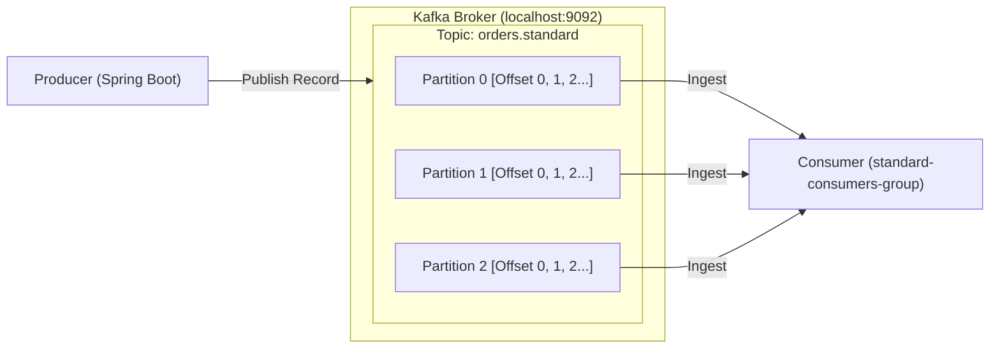

# 🚀 Getting Started with Apache Kafka in Spring Boot

Welcome to the **Spring Boot Apache Kafka Showcase**! If you are new to Apache Kafka or event-driven streaming architectures, this guide will walk you through the essential concepts from the ground up and give you hands-on experience using this live project.

---

## 📚 1. Core Kafka Concepts in Plain English

Traditional message queues (like RabbitMQ or ActiveMQ) delete messages once a consumer acknowledges them. **Apache Kafka** is fundamentally different: it is an **immutable, distributed commit log**. Messages are written sequentially to disk and kept for a configurable retention window (e.g., 7 days), allowing multiple independent consumers to read the stream at their own pace.



### Key Terminology

1. **Broker**:
   - The Kafka server process running on your machine.
   - In modern Kafka (including this showcase), brokers run in **KRaft** mode (Kafka Raft metadata mode), which eliminates the legacy Apache ZooKeeper dependency.

2. **Topic**:
   - A named stream or category to which records are published (e.g., `orders.standard`, `orders.high-priority`).

3. **Partition**:
   - A topic is sliced into one or more **partitions**.
   - **Ordering Guarantee**: Kafka strictly guarantees FIFO (first-in, first-out) order **within a single partition**, but not across multiple partitions.
   - **Parallelism**: Multiple consumers in the same group can read different partitions in parallel.

4. **Partition Key & Hashing**:
   - When a producer sends a record, it can provide an optional `key` (such as `customerId` or `orderId`).
   - Kafka hashes the key (`murmur2(key) % num_partitions`) to consistently route records with the same key to the **exact same partition**. This guarantees strict per-customer or per-order processing sequence.

5. **Offset**:
   - An immutable, sequential integer assigned to each record in a partition (e.g., offset `0`, `1`, `2`...).
   - Consumers commit their read offsets so they can resume seamlessly if restarted.

6. **Consumer Group**:
   - A set of consumer processes cooperating to read from a topic.
   - Each partition is assigned to exactly **one** consumer instance within the group, enabling automatic workload sharing.

7. **Dead Letter Topic (DLT)**:
   - A secondary topic (e.g., `orders.retryable.DLT`) designated to capture poisoned or unprocessable messages after maximum retry attempts have been exhausted.

8. **Kafka Transactions**:
   - A mechanism allowing a producer to publish to multiple topics or partitions atomically. Either all messages are committed, or none are made visible to read-committed consumers.

---

## 🏛 2. Architecture of This Showcase

This application demonstrates 6 distinct publishing and consumption patterns:

| Topic | Partitions | Consumer Group | Key Capabilities Demonstrated |
| :--- | :---: | :--- | :--- |
| `orders.standard` | 3 | `standard-consumers-group` | Key-based partition routing, tracing headers (`X-Correlation-ID`) |
| `orders.high-priority` | 2 | `vip-orders-group` | `RecordFilterStrategy` (drops non-HIGH priority records upstream) |
| `orders.retryable` | 3 | `retryable-orders-group` | Automatic retry policy (2 retries with 1s backoff) |
| `orders.retryable.DLT` | 1 | `dlt-monitor-group` | Dead Letter Topic consumer capturing poisoned payloads |
| `orders.batch` | 3 | `batch-consumers-group` | High-throughput batch consumption (`List<ConsumerRecord>`) |
| `events.transactional`| 2 | - | Atomic multi-message commits (`executeInTransaction`) |

---

## 🚦 3. Step-by-Step Hands-On Quickstart

### Step 1: Verify the Kafka Broker is Running

The local Kafka broker runs under Termux KRaft mode on port `9092`. You can check its process status with:

```bash
pgrep -f kafka.Kafka
```

If it is ever stopped, you can start it with:
```bash
/data/data/com.termux/files/home/kafka_2.13-4.3.1/bin/kafka-server-start.sh \
  /data/data/com.termux/files/home/kafka_2.13-4.3.1/config/server.properties &
```

### Step 2: Start the Spring Boot Application

In the project root directory:
```bash
cd /sdcard/Download/termux/spring-framework-6/spring-kafka-showcase
mvn spring-boot:run
```

Once started, verify the health status:
```bash
curl http://localhost:8080/actuator/health
# Expected: {"status":"UP"}
```

### Step 3: Open Swagger UI in Your Browser

Open your browser to:
👉 **[http://localhost:8080/swagger-ui.html](http://localhost:8080/swagger-ui.html)**

Swagger UI lets you inspect all schemas, view sample payloads, and execute requests directly from an interactive web interface!

---

## 🧪 4. Tutorial: Testing Kafka Features Live

You can test these endpoints using either the **Swagger UI** or the **cURL** commands below.

### Exercise 1: Publish a Simple Order (Key Hashing)
Publishes an order to `orders.standard`. The customer ID `CUST-100` determines which partition receives the record.

```bash
curl -X POST http://localhost:8080/api/kafka/publish/simple \
  -H "Content-Type: application/json" \
  -d '{
    "orderId": "ORD-1001",
    "customerId": "CUST-100",
    "skuCode": "SKU-HEADPHONES",
    "quantity": 1,
    "price": 199.99,
    "priority": "NORMAL",
    "simulateFailure": false
  }'
```
**What happens behind the scenes:**
1. The producer hashes `"CUST-100"` and sends the event to a specific partition.
2. The broker commits the record and returns an offset.
3. `KafkaConsumerService.consumeStandard` consumes the record and stores it in the in-memory audit log.

---

### Exercise 2: Explicit Partition Targeting with Tracing Headers
Sends an order explicitly to partition `2` and injects distributed tracing headers (`X-Correlation-ID`, `X-Source-Service`).

```bash
curl -X POST "http://localhost:8080/api/kafka/publish/partitioned?partition=2" \
  -H "Content-Type: application/json" \
  -d '{
    "orderId": "ORD-1002",
    "customerId": "CUST-200",
    "skuCode": "SKU-KEYBOARD",
    "quantity": 1,
    "price": 89.50,
    "priority": "NORMAL",
    "simulateFailure": false
  }'
```
**Notice the response:**
The status includes `SUCCESS (Correlation: <uuid>)`, confirming the header was generated and acknowledged.

---

### Exercise 3: Filtered VIP Consumer Pipeline
The `orders.high-priority` consumer is equipped with a `RecordFilterStrategy` that discards non-HIGH priority orders before listener logic runs.

**A) Send HIGH Priority Order (Accepted):**
```bash
curl -X POST http://localhost:8080/api/kafka/publish/priority \
  -H "Content-Type: application/json" \
  -d '{
    "orderId": "ORD-VIP-1",
    "customerId": "VIP-99",
    "skuCode": "SKU-IPHONE",
    "quantity": 1,
    "price": 1499.00,
    "priority": "HIGH",
    "simulateFailure": false
  }'
```
*(Check audit trail: status will be `HIGH_PRIORITY_PROCESSED`.)*

**B) Send NORMAL Priority Order to Same Topic (Discarded):**
```bash
curl -X POST http://localhost:8080/api/kafka/publish/priority \
  -H "Content-Type: application/json" \
  -d '{
    "orderId": "ORD-LOW-1",
    "customerId": "REGULAR-1",
    "skuCode": "SKU-CABLE",
    "quantity": 1,
    "price": 19.99,
    "priority": "NORMAL",
    "simulateFailure": false
  }'
```
*(Check application logs: `[KAFKA-FILTER] Discarding non-HIGH priority record`. It is never added to the audit ledger!)*

---

### Exercise 4: Failure Simulation & Dead Letter Topic (DLT)
Test system resilience when a bad message arrives.

```bash
curl -X POST "http://localhost:8080/api/kafka/publish/retry-dlt?fail=true" \
  -H "Content-Type: application/json" \
  -d '{
    "orderId": "ORD-FAIL-99",
    "customerId": "CUST-POISON",
    "skuCode": "SKU-BAD-PAYLOAD",
    "quantity": 1,
    "price": 9.99,
    "priority": "LOW",
    "simulateFailure": true
  }'
```
**What happens behind the scenes:**
1. Consumer attempts to process `ORD-FAIL-99`.
2. Because `simulateFailure=true`, a `RuntimeException` is thrown.
3. `DefaultErrorHandler` catches the exception and retries 2 times with a 1000ms delay.
4. After retries are exhausted, `DeadLetterPublishingRecoverer` diverts the message to `orders.retryable.DLT`.
5. The `dlt-monitor-group` listener intercepts the dead letter and flags it as `ROUTED_TO_DLT`.

---

### Exercise 5: Bulk Batch Publishing & Consumption
Publishes a JSON array of events that are ingested in bulk by a batch-enabled Kafka listener container.

```bash
curl -X POST http://localhost:8080/api/kafka/publish/batch \
  -H "Content-Type: application/json" \
  -d '[
    {"orderId":"ORD-B1","customerId":"CUST-1","skuCode":"SKU-A","quantity":2,"price":10.0,"priority":"NORMAL","simulateFailure":false},
    {"orderId":"ORD-B2","customerId":"CUST-2","skuCode":"SKU-B","quantity":5,"price":25.0,"priority":"NORMAL","simulateFailure":false}
  ]'
```

---

### Exercise 6: Atomic Kafka Transactions
Publishes multiple events atomically inside `kafkaTemplate.executeInTransaction`.

```bash
curl -X POST http://localhost:8080/api/kafka/publish/transaction \
  -H "Content-Type: application/json" \
  -d '[
    {"orderId":"ORD-TX1","customerId":"CUST-T1","skuCode":"SKU-TX1","quantity":1,"price":100.0,"priority":"HIGH","simulateFailure":false},
    {"orderId":"ORD-TX2","customerId":"CUST-T2","skuCode":"SKU-TX2","quantity":2,"price":200.0,"priority":"HIGH","simulateFailure":false}
  ]'
```

---

### Exercise 7: Inspecting the In-Memory Audit Trail

Check all successfully processed messages:
```bash
curl http://localhost:8080/api/kafka/audit/received
```

Check poisoned messages in the Dead Letter Topic:
```bash
curl http://localhost:8080/api/kafka/audit/dlt
```

Check summary statistics:
```bash
curl http://localhost:8080/api/kafka/audit/summary
```

---

### Exercise 8: Inspecting the Live Log Files

The app writes logs to disk in the `logs/` directory:

```bash
# View general application events & consumer logs
tail -n 30 logs/spring-kafka-showcase.log

# View DLT routing and listener exceptions
cat logs/spring-kafka-showcase-error.log
```

---

## 🛠 5. Useful Kafka CLI Cheat Sheet

Kafka ships with command-line utilities located in `/data/data/com.termux/files/home/kafka_2.13-4.3.1/bin/`:

### 1. List all active topics:
```bash
/data/data/com.termux/files/home/kafka_2.13-4.3.1/bin/kafka-topics.sh \
  --bootstrap-server localhost:9092 --list
```

### 2. Describe a specific topic (view partitions, leaders, ISRs):
```bash
/data/data/com.termux/files/home/kafka_2.13-4.3.1/bin/kafka-topics.sh \
  --bootstrap-server localhost:9092 --describe --topic orders.standard
```

### 3. Inspect Consumer Groups and Partition Lag:
```bash
/data/data/com.termux/files/home/kafka_2.13-4.3.1/bin/kafka-consumer-groups.sh \
  --bootstrap-server localhost:9092 --describe --group standard-consumers-group
```
*(Lag shows how many records are waiting in each partition to be consumed.)*

### 4. Tail live messages in a topic from the console:
```bash
/data/data/com.termux/files/home/kafka_2.13-4.3.1/bin/kafka-console-consumer.sh \
  --bootstrap-server localhost:9092 --topic orders.standard --from-beginning
```

---

## ❓ 6. Common Questions & Troubleshooting

### Why are my messages consumed out of order?
> **Answer**: Kafka guarantees ordering **only within the same partition**. If messages have different keys (or no keys), they are distributed across multiple partitions. To preserve order for a specific customer or entity, always supply the same routing key (e.g., `customerId`).

### What does "Lag" mean?
> **Answer**: `Lag = LOG-END-OFFSET - CURRENT-OFFSET`. A lag of 0 means the consumer is fully caught up with the producer in real-time. High or growing lag indicates the consumer is struggling to keep up with producer throughput.

### How does Spring Kafka handle consumer crashes?
> **Answer**: When a consumer instance fails to send heartbeats, Kafka triggers a **rebalance**. The broker reassigns the unconsumed partitions to surviving consumers in the group, which resume reading from the last committed offset.

---

## 📖 7. Next Steps & References

- [Spring Kafka Official Documentation](https://docs.spring.io/spring-kafka/reference/)
- [Apache Kafka Documentation](https://kafka.apache.org/documentation/)
- Project Architecture Guide: [ARCHITECTURE_AND_METHODS.md](file:///sdcard/Download/termux/spring-framework-6/spring-kafka-showcase/ARCHITECTURE_AND_METHODS.md)
- Project README: [README.md](file:///sdcard/Download/termux/spring-framework-6/spring-kafka-showcase/README.md)
